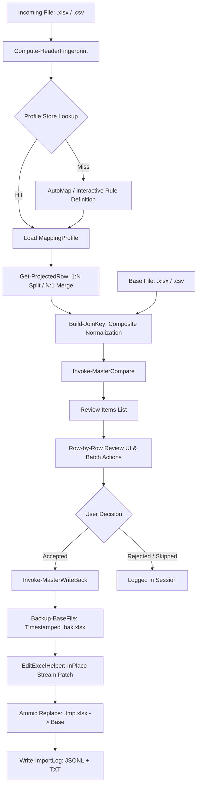

# Excel Master Updater — Architectural Technical Specification

## 1. System Overview

**Excel Master Updater** is built as an architectural sibling of `Compare-ExcelFiles.ps1` with the goal of synchronizing, updating, and appending records to a single **Master Base Excel file** from recurring incoming update files.

### Key Architectural Constraints
- **Zero External Dependencies**: Operates entirely with built-in .NET assemblies (`System.IO.Compression`, `System.Xml`, `System.Xml.Linq`, `PresentationFramework`, `PresentationCore`, `WindowsBase`, `System.Windows.Forms`). No Excel COM automation and no `ImportExcel` module required.
- **Dual Runtime Compatibility**: 100% compatible with Windows PowerShell 5.1 (.NET Framework 4.7.2+) and PowerShell 7.x (.NET Core 6.0+).
- **Standalone Binary Deployment**: Self-contained executable compilation via `ps2exe` with embedded `language.json` catalog and application icon.
- **Strict Encoding Standard**: Mandatory UTF-8 with BOM (`0xEF, 0xBB, 0xBF`) across all script, configuration, and data files.

---

## 2. Module & Region Layout

The application is structured as a consolidated single-script architecture partitioned into 10 cohesive functional regions:

```
Master-Updater.ps1
├── Region 1: Dependencies & Embedded C# Classes
│   ├── FastExcelHelper (OpenXML ZIP streaming reader and exporter)
│   ├── FastDiffHelper (High-speed string normalizer and comparison engine)
│   └── EditExcelHelper (InPlace OpenXML XML patching and row appending)
├── Region 2: Configuration Management (Get-AppConfig / Save-AppConfig)
├── Region 3: Profile Store & Header Fingerprint Auto-Resolution
├── Region 4: Mapping Projection Engine (Get-ProjectedRow & Build-JoinKey)
├── Region 5: Compare Engine (Invoke-MasterCompare)
├── Region 6: Metadata Stamping Engine (Get-StampedMetadataValue)
├── Region 7: Write-Back Engine (Backup-BaseFile & Invoke-MasterWriteBack)
├── Region 8: Audit Logging (Write-ImportLog)
├── Region 9: WPF UI Engine & Theme System
└── Region 10: Application Entry Point (Show-MasterUpdater)
```

---

## 3. Data Flow Diagram



---

## 4. Detailed Component Architecture

### 4.1 InPlace OpenXML Stream Patching (`EditExcelHelper`)
Unlike COM-based or heavy document frameworks, `EditExcelHelper` opens the `.xlsx` package directly as a `System.IO.Compression.ZipArchive` in `Update` mode:
1. **Isolated Cell Patching**: Locates `<row r="N">` inside `xl/worksheets/sheetN.xml` using an `XmlReader` / `XmlWriter` forward stream.
2. **Inline String Serialization**: Replaces or inserts target cells using `<c r="Xn" t="inlineStr"><is><t>value</t></is></c>`. This bypasses modifying `xl/sharedStrings.xml`, eliminating the risk of corrupting shared string table indices across multi-sheet workbooks.
3. **Format & Multi-Sheet Preservation**: Untouched cells, row heights, column formatting, cell backgrounds, and other worksheets (`sheet2.xml`, `sheet3.xml`) remain completely untouched in the zip container.
4. **Row Appending**: Injects newly accepted rows sequentially before `</sheetData>`, updating the worksheet `<dimension ref="..."/>` element.
5. **Safety Guards**: Scans workbook parts for unsupported elements (`<tableParts>`, `<pivotTable>`, shared formulas `<f t="shared">`) and aborts with a descriptive exception before writing.

### 4.2 Mapping Projection Engine (`Get-ProjectedRow`)
Supports bidirectional data shaping from incoming layouts to base columns:
- **N:1 Column Merge**: Combines multiple source fields (`UpdateColumns[]`) into a single base column (`BaseColumns[]`) using merge modes:
  - `Exact`: First non-empty value.
  - `FirstNonEmpty`: First non-blank value in order.
  - `Concatenate`: Joins values using a configurable delimiter (e.g. `", "` or `" - "`).
- **1:N Column Split**: Expands a single composite source field (e.g. `AdresZamieszkania = "Warszawa, Polna 1"`) across multiple base columns (`Miejscowosc`, `UlicaDom`) via delimiter split or regular expressions.

### 4.3 Deterministic Header Fingerprints
Profile auto-resolution is computed as:
$$\text{HeaderFingerprint} = \text{SHA256}(\text{SheetName} + \text{"\#"} + \text{Join}("|", \text{NormalizedHeaders}))$$
Profiles are persisted as version 2.0 JSON files under `%APPDATA%\MasterUpdater\Profiles`. On file ingestion, fingerprints match instantly, requiring zero manual configuration for recurring monthly sources.

### 4.4 Compare & Ambiguity Logic
`Invoke-MasterCompare` classifies each incoming record:
- **`New`**: Join key not found in master base index.
- **`Changed`**: Join key matched; one or more mapped columns differ. Exact Excel coordinates (`CellRef`, e.g. `H6`) are calculated.
- **`Unchanged`**: Join key matched; values identical under configured normalization options (`IgnoreCase`, `Trim`, `IgnoreSpecialChars`, `IgnoreAllSpaces`).
- **`Ambiguous`**: Flagged if source key is empty, key is duplicated within incoming file, or matches multiple base records.
- **`Removed`**: Triggered when `DetectRemovedRows = $true` for base rows absent from incoming source.

### 4.5 Resilient File Ingestion & Encoding Detection (`FastExcelHelper`)
- **Multi-Delimiter Heuristics**: Analyzes unquoted frequencies of semicolons (`;`), commas (`,`), tabs (`\t`), and pipes (`|`). Defaults to `;` when equal.
- **Encoding Auto-Detection**: Inspects initial byte stream:
  - Byte Order Marks: UTF-8 (`EF BB BF`), UTF-16 LE (`FF FE`), UTF-16 BE (`FE FF`).
  - Strict multi-byte UTF-8 sequence validation.
  - Automatic fallback to Windows-1250 (Central European ANSI) when high bytes exceed ASCII and violate UTF-8 grammar, ensuring seamless compatibility with legacy accounting and ERP exports.

### 4.6 Reactive UI & Interactive Data Exploration (`Region 9`)
- **Mapping Rule Search Filter**: Implemented via WPF `CollectionViewSource::GetDefaultView` predicate filtering over `BaseColumns`, `UpdateColumns`, and `MergeMode` without rebuilding UI controls.
- **Live Projection & Join Key Reactivity**: Changing Join Key selection triggers immediate re-projection in the DataGrid sample preview, visually denoting identity keys with a `🔑 ` icon in the Target Base Column.
- **Direct Double-Click Editing**: Hooked via `lbReviewItems.add_MouseDoubleClick`, bypassing modal buttons and opening the cell override dialog directly.

### 4.7 Headless Pipeline & Execution Summary Contract (`Invoke-HeadlessMasterUpdater`)
- **Batch Policies**: Supports `None`, `AllNonAmbiguous`, `OnlyChanged`, and `OnlyNew`.
- **Machine-Readable Summary Artifact**: Emits `last_execution_summary.json` (or custom `-SummaryJsonPath`) with schema:
  - `Success`: Boolean execution status.
  - `TotalIncoming`, `NewRows`, `ChangedRows`, `AmbiguousRows`, `UnchangedRows`, `AcceptedRows`, `UpdatedCells`, `AddedRows`: Integer metrics.
  - `BaseBackupPath`: Path to the generated `.bak.xlsx` backup.
  - `ReportPath`: Path to exported HTML, XLSX, or CSV discrepancy report.
  - `SummaryJsonPath`: Path to the summary JSON file itself.

---

## 5. Security & PII Protection (GDPR / RODO)

1. **Restricted Audit Logs**: Log directories and backups must be restricted to authorized users via NTFS Access Control Lists (ACLs).
2. **PII Masking (`RedactNamesInLog`)**: When active, replaces names, addresses, and phone numbers in `.jsonl` and `.txt` audit reports with hashed masks (e.g. `[REDACTED_NAME]`).
3. **Atomic File Replacement**: Files are written to temporary staging containers (`<file>.tmp.xlsx`) and verified with `[FastExcelHelper]::ReadSheet` prior to `File.Replace()`, guaranteeing zero data corruption on power loss.

---

## 6. Build & Packaging Pipeline

`Build-Exe.ps1` invokes `PS2EXE` with the following configuration:
- `-noConsole`: Suppresses console window for desktop GUI.
- `-STA`: Enforces Single-Threaded Apartment mode required by WPF controls.
- `-embedFiles language.json`: Embeds localization catalogs directly into executable resources.
- `-icon Logo_AM6.ico`: Applies customized application branding.
